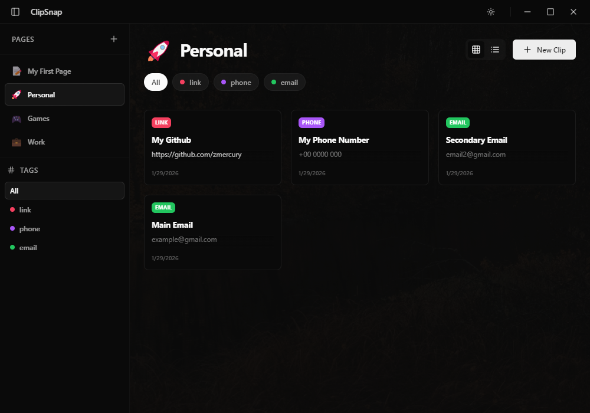

# ClipSnap

ClipSnap is a clipboard manager built with Electron and React. It features a simple UI/UX.



## ✨ Features

- **Organize by Page**: Group your clips into different pages.
- **Tag with Ease**: Add tags to clips for better filtering.
- **Real-time Search**: Find any clip quickly across all pages.
- **Grid & List Views**: Choose the layout that works best for you.
- **Pinned Clips**: Keep your most important items at the top.


## 🛠️ Tech Stack

- **Core**: [Electron](https://www.electronjs.org/) & [React](https://reactjs.org/)
- **Styling**: [TailwindCSS](https://tailwindcss.com/) & [Vanilla CSS](https://developer.mozilla.org/en-US/docs/Web/CSS)
- **Animations**: [Framer Motion](https://www.framer.com/motion/)
- **Build System**: [Vite](https://vitejs.dev/) & [Electron Forge](https://www.electronforge.io/)
- **State Management**: [Electron Store](https://github.com/sindresorhus/electron-store)
- **Icons**: [Lucide React](https://lucide.dev/) & [Radix UI Icons](https://icons.radix-ui.com/)


## 🚀 Getting Started

### Prerequisites

- [Bun](https://bun.sh/) or [Node.js](https://nodejs.org/)
- Git

### Installation

1. Clone the repository:
   ```bash
   git clone https://github.com/zmercury/clipsnap.git
   cd clipsnap
   ```

2. Install dependencies:
   ```bash
   bun install
   ```

### Development

Run the web version in development mode:
```bash
bun run dev
```

Run the desktop application:
```bash
bun run start:desktop
```

## 📦 Building

To generate a portable Windows build:
```bash
npm run build:portable
```
The output will be located in the `out/make` and `release` directories.

## 🚀 Releases

The latest stable build can always be found in the [GitHub Releases](https://github.com/zmercury/clipsnap/releases) section.

---
Built with ❤️ by [zmercury](https://github.com/zmercury)

